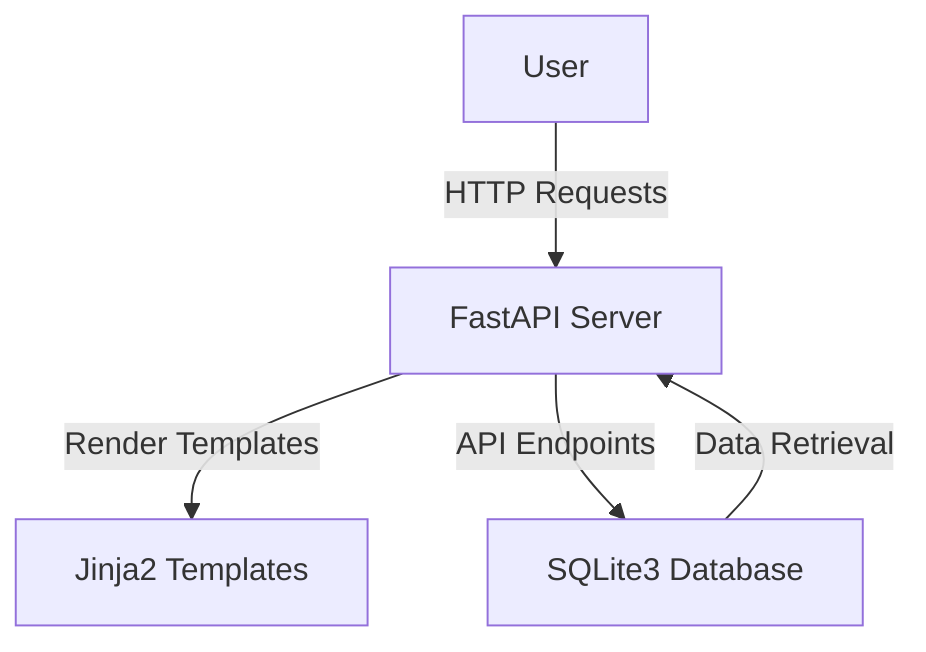

# AI-Powered Chatbot for Mental Health Support

## Overview
The AI-Powered Chatbot for Mental Health Support is an innovative platform designed to provide accessible mental health resources and support through a user-friendly web interface. This project leverages artificial intelligence to facilitate conversations with users, offering personalized assistance and resources tailored to individual needs. By combining technology with mental health expertise, the chatbot aims to create a safe space for users to discuss their mental health concerns and access valuable resources.

This project addresses the growing need for mental health support by providing an easily accessible platform that can be used by individuals seeking guidance, support, or information about mental health. Whether you're looking for a safe space to talk or need resources for mental health management, this chatbot is designed to be a helpful companion.

## Features
- **AI-Powered Chat**: Engage in conversations with an AI chatbot designed to provide mental health support and guidance.
- **User Profiles**: Create and manage user profiles to receive personalized recommendations and track preferences.
- **Resource Library**: Access a curated list of mental health resources and links to external support sites.
- **Responsive Design**: Enjoy a user-friendly interface that adapts to various devices, ensuring accessibility.
- **Data Privacy**: Secure handling of user data with a focus on privacy and confidentiality.
- **Interactive UI**: Smooth navigation and interactive elements for an engaging user experience.
- **Database Integration**: Persistent storage of user profiles and chat history for continuity in user interactions.

## Tech Stack
| Technology   | Description                                 |
|--------------|---------------------------------------------|
| Python 3.11+ | Core programming language                   |
| FastAPI      | Web framework for building APIs             |
| Uvicorn      | ASGI server for serving FastAPI applications|
| Jinja2       | Templating engine for rendering HTML        |
| SQLite3      | Lightweight database for storing data       |

## Architecture
The project architecture is designed to separate concerns and ensure scalability. The backend, built with FastAPI, serves the frontend templates rendered by Jinja2. The application uses SQLite3 for database management, storing user profiles, chat messages, and resources. The data flow is managed through API endpoints that interact with the database.



## Getting Started

### Prerequisites
- Python 3.11+
- pip (Python package manager)
- Docker (optional, for containerized deployment)

### Installation
1. Clone the repository:
   ```bash
   git clone https://github.com/yourusername/ai-powered-chatbot-for-mental-health-support.git
   cd ai-powered-chatbot-for-mental-health-support
   ```
2. Install the required Python packages:
   ```bash
   pip install -r requirements.txt
   ```

### Running the Application
1. Start the FastAPI application using Uvicorn:
   ```bash
   uvicorn app:app --reload
   ```
2. Visit the application in your browser at `http://127.0.0.1:8000`

## API Endpoints
| Method | Path                   | Description                                         |
|--------|------------------------|-----------------------------------------------------|
| GET    | `/`                    | Home page                                           |
| GET    | `/chat`                | Chat interface                                      |
| GET    | `/profile`             | User profile management                             |
| GET    | `/resources`           | List of mental health resources                     |
| GET    | `/about`               | About the project                                   |
| GET    | `/api/chat`            | Retrieve chat messages                              |
| POST   | `/api/users`           | Create or update a user profile                     |
| GET    | `/api/resources`       | Retrieve mental health resources                    |
| GET    | `/api/user/{user_id}`  | Retrieve a specific user profile by user ID         |

## Project Structure
```
/
|-- app.py                # Main application file
|-- Dockerfile            # Docker configuration file
|-- requirements.txt      # Python dependencies
|-- start.sh              # Script to start the application
|-- static/
|   |-- css/
|   |   |-- style.css     # Stylesheet for the application
|   |-- js/
|       |-- main.js       # JavaScript for client-side interactions
|-- templates/
|   |-- about.html        # About page template
|   |-- chat.html         # Chat page template
|   |-- home.html         # Home page template
|   |-- profile.html      # User profile page template
|   |-- resources.html    # Resources page template
```

## Screenshots
*Screenshots will be added here to showcase the application's interface and features.*

## Docker Deployment
1. Build the Docker image:
   ```bash
   docker build -t mental-health-chatbot .
   ```
2. Run the Docker container:
   ```bash
   docker run -d -p 8000:8000 mental-health-chatbot
   ```

## Contributing
Contributions are welcome! Please fork the repository and submit a pull request with your changes. Ensure that your code follows the project's coding standards and includes appropriate tests.

## License
This project is licensed under the MIT License. See the LICENSE file for more details.

---
Built with Python and FastAPI.